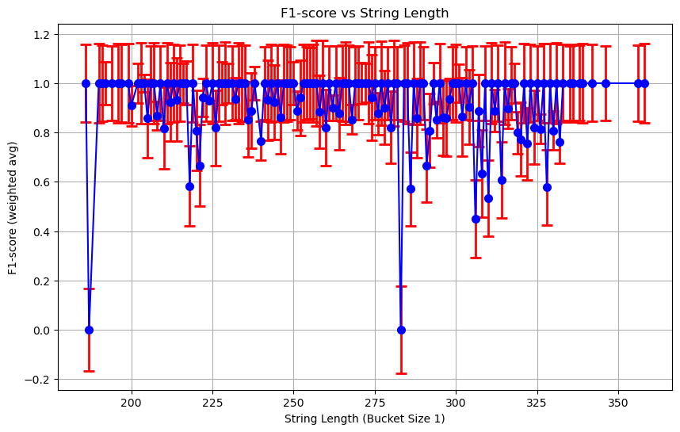

### GPT 推理与猜测对比

| Experiment Name                                      | Class      | F1-Score  | Precision | Recall    | Support  |
|------------------------------------------------------|------------|-----------|-----------|-----------|----------|
| 4o-mini-bracket-matching-pureguess                   | True       | 0.9709    | 0.9434    | 1.0000    | 50.0     |
|                                                      | False      | 0.9691    | 1.0000    | 0.9400    | 50.0     |
|                                                      | Weighted   | **0.9700**| 0.9717    | 0.9700    | 100.0    |
| 4o-mini-bracket-matching-pureguess-scaleup           | True       | 0.9826    | 0.9732    | 0.9922    | 768.0    |
|                                                      | False      | 0.9814    | 0.9916    | 0.9713    | 732.0    |
|                                                      | Weighted   | **0.9820**| 0.9822    | 0.9820    | 1500.0   |
| 4o-mini-bracket-matching-pureguess-scaleuplong       | True       | 0.8993    | 0.9615    | 0.8446    | 502.0    |
|                                                      | False      | 0.9101    | 0.8605    | 0.9659    | 498.0    |
|                                                      | Weighted   | **0.9047**| 0.9112    | 0.9050    | 1000.0   |
| 4o-mini-bracket-matching-guess2explain-scaleupandlong| True       | 0.9474    | 0.9451    | 0.9496    | 1270.0   |
|                                                      | False      | 0.9437    | 0.9475    | 0.9398    | 1230.0   |
|                                                      | Weighted   | **0.9456**| 0.9463    | 0.9448    | 2500.0   |
| 4o-mini-bracket-matching-reason2conclude             | True       | 0.9307    | 0.9216    | 0.9400    | 50.0     |
|                                                      | False      | 0.9149    | 0.9773    | 0.8600    | 50.0     |
|                                                      | Weighted   | **0.9228**| 0.9494    | 0.9000    | 100.0    |

## Reason2Conclude

## PureGuess

## PureGuess-ScaleUp

## PureGuess-ScaleUpLong

## Guess2Explain-ScaleUpandLong

## Summary

在括号匹配问题上，GPT-4o-mini 对于长度为 50 以内的串几乎表现出 100% 的准确率。

对于长度在 50-500 范围内，仍然表现出不俗的猜测性能。

相较于 Reason2Conclude / PureGuess / Guess2Explain 三种模式，我们发现 PureGuess仍然是性能最好的。

从 LLM 输出的 Reason 内容来看，它根本算不清楚，其内在机制大概率完全是依靠 Language Model 的直觉。

## TODO

- 测试具体是何种形式语言能让 LLM 表现出如此结果？

- 更一般的，这种任务具有的具体性质是什么？

- 各个模型都适用吗？是否存在对模型大小的要求？

- 考虑到这种任务不会出现在训练语料中，如何解释这种模型的直觉？

- 能否根据这种直觉，测试一个新的未见任务。